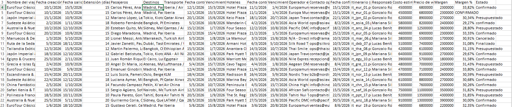
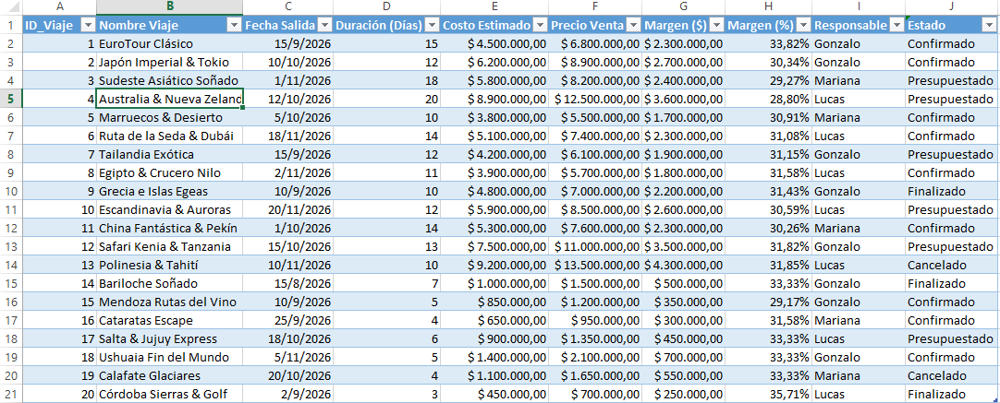
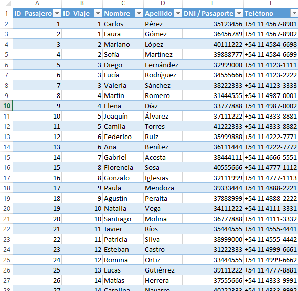
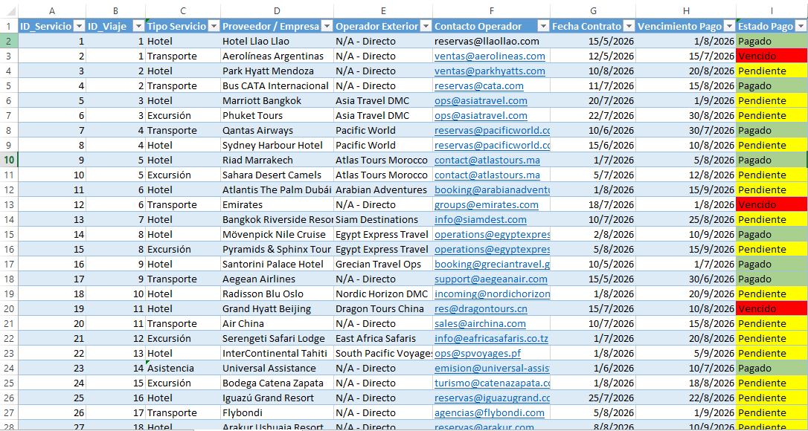
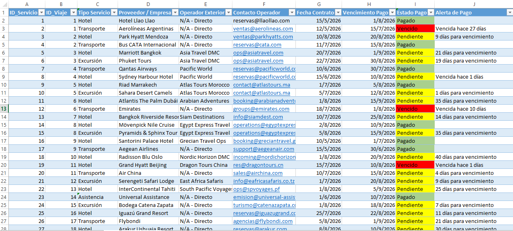

# Sistema de Gestión Operativa de Viajes y Control Financiero

**Gonzalo Rodríguez Spuch** — *Data Portfolio Project* – 2026

---

## 📋 Tabla de Contenidos (Table of Contents)

* [0. Descargo de Responsabilidad (Disclaimer)](#0-descargo-de-responsabilidad-disclaimer)
* [1. Visión General del Proyecto (Project Overview)](#1-visión-general-del-proyecto-project-overview)
* [2. Objetivos del Proyecto (Project Goals)](#2-objetivos-del-proyecto-project-goals)
* [3. Levantamiento de Requerimientos y Metodología (Requirement Gathering)](#3-levantamiento-de-requerimientos-y-metodología-requirement-gathering)
* [4. Diagnóstico de Datos y Puntos de Dolor (Legacy System Analysis)](#4-diagnóstico-de-datos-y-puntos-de-dolor-legacy-system-analysis)
* [5. Diseño de la Solución: Arquitectura Relacional de 3 Pestañas](#5-diseño-de-la-solución-arquitectura-relacional-de-3-pestañas)
* [6. Recomendaciones Estratégicas](#6-recomendaciones-estratégicas)
* [7. Consideraciones y Supuestos (Caveats)](#7-consideraciones-y-supuestos-caveats)
* [8. Potencial y Escalabilidad Futura (Roadmap Técnico)](#8-potencial-y-escalabilidad-futura-roadmap-técnico)

---

## 0. Descargo de Responsabilidad (Disclaimer)

Toda la información presentada en este repositorio ha sido completamente anonimizada y modificada para proteger la confidencialidad institucional y comercial. Los datos, figuras, registros y conclusiones no representan el desempeño real de la organización y tienen un propósito exclusivamente educativo, analítico y de demostración técnica.

## 1. Visión General del Proyecto (Project Overview)

Muchas agencias de viajes y PyMEs operativas dependen de planillas de cálculo para gestionar expedientes, clientes y contrataciones con proveedores. Sin embargo, con el tiempo, estas hojas de trabajo tienden a acumular inconsistencias, datos fragmentados, errores de tipeo manuales y celdas sobrecargadas de texto. Esto degrada la confiabilidad de la información, haciendo complejo el seguimiento del margen operativo por viaje, el control de vencimientos de pago y la coordinación oportuna de los servicios.

Este proyecto aborda estos desafíos mediante el diseño de una **arquitectura de datos relacional y estandarizada en Microsoft Excel**. El objetivo es estructurar el registro operativo en entidades interconectadas, eliminando la duplicidad de datos, automatizando el control financiero y garantizando la integridad de los registros desde la carga inicial.

Los resultados e insights generados a través de esta estructura son especialmente valiosos para:
* **Equipos Operativos y de Venta:** Para gestionar clientes y reservas asociadas a un viaje sin saturar las planillas principales ni perder trazabilidad.
* **Coordinación y Finanzas:** Para identificar vencimientos de pago a hoteles, transportes, excursiones, operadores externos en tiempo real, evitando penalizaciones o cancelaciones de reservas.
* **Administración y Gerencia:** Para evaluar la rentabilidad real y el margen de ganancia de cada expedición o paquete turístico antes y después de su ejecución.

Toda la solución está optimizada para servir como una base de datos limpia y lista para ser migrada a sistemas relacionales SQL o conectada a tableros de control interactivos en **Power BI**.

## 2. Objetivos del Proyecto (Project Goals)

Este proyecto fue diseñado en torno a tres objetivos estratégicos orientados a optimizar la gestión operativa, garantizar la calidad de la información y proteger el margen financiero de la agencia:

### 1. Estandarización e Integridad de la Base de Datos
* **Diseñar un modelo relacional de datos** que elimine el amontonamiento de texto en celdas únicas y reduzca a cero la duplicidad de información.
* **Restringir errores de carga manual** mediante la implementación de reglas de validación estandarizadas (listas desplegables para estados operativos, tipos de servicio y pagos).
* **Asegurar la escalabilidad de los registros** mediante el uso de estructuras de datos oficiales (Tablas de Excel) que propaguen fórmulas y formatos automáticamente.

### 2. Control Financiero y Trazabilidad de Margen
* **Automatizar el cálculo de rentabilidad** para cada paquete turístico o expedición, permitiendo visibilidad inmediata de los márgenes en pesos ($) y en porcentaje (%).
* **Identificar de forma temprana viajes con márgenes inferiores al umbral mínimo** de rentabilidad deseado antes de la confirmación al cliente.
* **Proporcionar métricas claras de costos estimados vs. precios de venta** para respaldar la toma de decisiones en la fijación de tarifas.

### 3. Gestión de Riesgo Operativo y Control de Proveedores
* **Implementar un sistema visual de alertas (Semáforo de Pagos)** para clasificar compromisos con proveedores en `Pagado` 🟢, `Pendiente` 🟡 y `Vencido` 🔴.
* **Facilitar el seguimiento de fechas críticas de vencimiento** con hoteles, transportes y operadores para prevenir cancelaciones involuntarias de reservas o penalizaciones por mora.
* **Estructurar la información operativa** de forma limpia para que pueda ser migrada directamente a una base de datos SQL o conectada a un tablero interactivo en Power BI.

## 3. Levantamiento de Requerimientos y Metodología (Requirement Gathering)

El desarrollo del proyecto comenzó con una etapa de alineación operativa y relevamiento de necesidades junto a la Dirección / Jefatura Operativa de la agencia. 

### Solicitud Inicial del Negocio (Requerimientos Críticos)
Para centralizar la gestión de las operaciones, se definió inicialmente un listado de **22 variables/campos clave** que la empresa necesitaba registrar para cada expediente:

1. `Nombre del viaje`
2. `Fecha creación`
3. `Fecha salida`
4. `Extensión (días)`
5. `Pasajeros`
6. `Destinos`
7. `Transporte`
8. `Fecha contrato transporte`
9. `Vencimiento pago transporte`
10. `Hoteles`
11. `Fecha contrato hotel`
12. `Vencimiento pago hotel`
13. `Operador exterior`
14. `Contacto operador`
15. `Fecha confirmación`
16. `Itinerario (archivo)`
17. `Responsable`
18. `Costo estimado`
19. `Precio de venta`
20. `Margen ($)`
21. `Margen (%)`
22. `Estado`

---

### Diagnóstico Técnico: El Riesgo de la "Tabla Plana"
Al analizar la lista de requerimientos delegada, se identificó un problema estructural clásico en la gestión de datos: **intentar volcar los 22 campos en una sola tabla continua (Flat Table)**.

Este enfoque tradicional presentaba tres fallas críticas de diseño:
1. **Saturación y falta de atomicidad:** Agrupar múltiples pasajeros o múltiples hoteles/transportes dentro de una sola celda impide filtrar, contar o auditar la información correctamente.
2. **Duplicidad de datos y redundancia:** Si un viaje incluye 3 hoteles y 2 transportes, repetir la fila principal para cada proveedor genera inconsistencias financieras en los montos totales.
3. **Alto riesgo de error humano:** Escribir textos extensos o fechas de vencimiento de forma desestructurada impide generar alertas automáticas de pago.

### Decisión de Arquitectura: Normalización y Modelo Relacional
Ante este diagnóstico, se propuso a la jefatura reestructurar el requerimiento original pasando de un registro plano a un **Modelo de Datos Relacional de 3 Entidades**, separando la cabecera del viaje, el detalle de pasajeros y el control individualizado de servicios/proveedores.

---

## 4. Diagnóstico de Datos y Puntos de Dolor (Legacy System Analysis)

Para documentar la problemática inicial, se analizó el registro histórico de operaciones. A continuación se presenta la captura del sistema previo en formato de **Tabla Plana**:

---

### Principales Inconsistencias y Defectos de Estructura Identificados

Al auditar la tabla plana original, se detectaron 5 categorías de fallas que afectaban la confiabilidad operativa y financiera:

1. **Saturación y Falta de Atomicidad en Celdas:**
   * **Pasajeros:** Celdas con hasta 4 o 5 nombres agrupados por comas (`Carlos Pérez, Ana Gómez, Juan Pérez`).
   * **Hoteles y Servicios:** Múltiples proveedores y estancias internacionales hacinadas en una sola celda (`Hotel Plaza Madrid, Hotel Mercure Paris, Hotel Artemide Roma`), impidiendo filtrar o liquidar pagos por proveedor individual.

2. **Duplicidad de Registros y Redundancia:**
   * Expedientes cargados múltiples veces por falta de un identificador único (`ID_Viaje`). Por ejemplo, la expedición `EuroTour Clásico` del 10/01/2026 figura dos veces con datos parcialmente redundantes, duplicando artificialmente la facturación de la empresa.

3. **Inconsistencia de Categorías y Errores de Tipeo (Falta de Validación):**
   * **Estados de pago/viaje:** Incoherencias tipográficas entre filas (`Confirmado`, `CONFIRMADO`, `confimado` [con error de ortografía], `Presupuestado`). Esto imposibilita el uso de tablas dinámicas y filtros automatizados.
   * **Destinos:** Variaciones como `París` (con tilde) y `Paris` (sin tilde).

4. **Formatos de Fecha Mezclados:**
   * Coexistencia de formatos regionales (`DD/MM/AAAA`) con formatos ISO (`AAAA-MM-DD`, e.g. `2026-02-15`), lo que rompe los cálculos automáticos de días de extensión y alertas de vencimiento en Excel.

5. **Imposibilidad de Auditar Vencimientos y Márgenes Financieros:**
   * Al tener las fechas de vencimiento de transportes y hoteles repartidas en celdas estáticas al costado de la fila, resulta imposible armar un cronograma unificado de pagos a proveedores o prever liquidaciones por vencer en la semana.
  
---

## 5. Diseño de la Solución: Arquitectura Relacional de 3 Pestañas

Para resolver de manera definitiva las inconsistencias del modelo plano anterior, se reestructuró la base de datos aplicando **principios de normalización de bases de datos**. 

Se diseñó una arquitectura de **3 entidades principales** interconectadas mediante claves relacionales (`ID_Viaje`), eliminando la redundancia de datos y garantizando que cada registro contenga únicamente información atómica.

### Vista y Estructura Detallada de las Pestañas
1. Pestaña "VIAJES" (Tabla Principal / Expedientes)Centraliza la información ejecutiva y los consolidados financieros de cada expediente comercial.Campos: ID_Viaje, Nombre Viaje, Fecha Salida, Duración (Días), Costo Estimado, Precio Venta, Margen ($), Margen (%), Responsable, Estado.
2. Pestaña "PASAJEROS" (Relación 1 a Muchos)Almacena los datos individuales de cada pasajero de forma atómica. Un expediente (ID_Viaje) puede tener múltiples pasajeros asignados.Campos: ID_Pasajero, ID_Viaje, Nombre, Apellido, DNI / Pasaporte, Teléfono.
3. Pestaña "SERVICIOS Y PAGOS" (Relación 1 a Muchos / Control de Proveedores)Desglosa individualmente los servicios contratados por viaje (hoteles, transportes) para auditar contratos y vencimientos de liquidación.Campos: ID_Servicio, ID_Viaje, Tipo Servicio, Proveedor / Empresa, Operador Exterior, Contacto Operador, Fecha Contrato, Vencimiento Pago, Estado Pago.

### Reglas de Validación e Integridad Aplicadas en Excel
1. Listas Desplegables (Validación de Datos): Estandarización de estados en la pestaña VIAJES (Confirmado, Presupuestado, Finalizado, Cancelado) y en SERVICIOS Y PAGOS (Pagado, Pendiente, Vencido).

2. Formato Automático de Fechas: Aplicación del formato regional estandarizado DD/MM/AAAA a todas las columnas temporales.

3. Cálculos Financieros Automatizados:

    Margen ($): Precio Venta - Costo Estimado

    Margen (%): Margen ($) / Precio Venta

---

## Capturas del Sistema

*Figura 1: Pestaña de Registro de Viajes y Clientes.*

*Figura 2: Control de Servicios, Operadores y Vencimiento de Pagos.*

*Figura 3: Dashboard de Indicadores Clave y Tablas Dinámicas.*

### Control Dinámico y Alerta de Vencimientos

Ahoratambien, para evitar demoras en los pagos a proveedores, prevenir recargos por mora y garantizar la continuidad operativa de los viajes, se incorporó la columna **`Estado de Vencimiento`** dentro de la estructura de *Servicios y Pagos*.

Esta columna funciona como una herramienta de gestión preventiva en tiempo real:

* **Monitoreo de Pendientes:** Para todas las facturas o compromisos pendientes, indica de forma exacta la cuenta regresiva de días restantes hasta la fecha límite (ej. *"7 días para vencimiento"*).
* **Detección de Mora:** Si el plazo expira sin haberse registrado el pago, calcula y señala automáticamente los días de atraso acumulados (ej. *"Vencida hace 6 días"*).
* **Limpieza Visual:** Una vez concretado el pago, la celda queda liberada para enfocar la atención del usuario únicamente en las partidas prioritarias.

> **Automatización Diaria sin Mantenimiento:**  
> Gracias al cálculo dinámico vinculado al reloj del sistema, los plazos se recalculan automáticamente cada vez que se abre la planilla. Esto permite que el equipo operativo cuente siempre con un estado de situación actualizado al día, sin necesidad de realizar modificaciones ni ajustes manuales.

--- 

## 6. Recomendaciones Estratégicas

Basado en el análisis operativo, el control de proveedores y el flujo de caja del sistema de gestión de viajes, se sugieren las siguientes acciones estratégicas para optimizar la operación:

### 1. Gestión de Proveedores y Servicios
* **Auditoría de vencimientos:** Implementar una revisión semanal del panel de pagos para evitar mora en proveedores críticos (como aerolíneas y cadenas hoteleras) y prevenir la cancelación imprevista de reservas.
* **Consolidación de operadores externos:** Identificar los operadores del exterior (`DMC`) con mayor volumen de contratación para renegociar tarifas mayoristas o mejores plazos de pago.
* **Control de servicios pendientes:** Establecer un protocolo de seguimiento sobre aquellos viajes en estado "En Proceso" que aún no tienen asignado o confirmado el 100% de sus servicios contratados.

### 2. Control Financiero y Flujo de Caja
* **Estandarización de alertas de pago:** Priorizar la cancelación de facturas vencidas para reducir recargos financieros y mantener una calificación crediticia óptima con los prestadores.
* **Proyección de ingresos vs. egresos:** Utilizar la información del Dashboard para prever los requerimientos de liquidez antes de las fechas pico de salidas de grupos y viajes corporativos.

### 3. Calidad de Datos y Mantenimiento de la Planilla
* **Validación en el ingreso de datos:** Restringir el ingreso manual mediante listas desplegables (Data Validation) en campos clave como *Estado del Viaje*, *Tipo de Servicio* y *Estado de Pago* para evitar inconsistencias en las tablas dinámicas.
* **Identificadores únicos:** Mantener la integridad referencial obligatoria mediante los campos `ID_Viaje` e `ID_Servicio` al registrar nuevas operaciones.

---

## 7. Consideraciones y Supuestos (Caveats)

Para la correcta interpretación de este modelo y sus datos de prueba, se deben tener en cuenta las siguientes consideraciones:

* **Datos de prueba y confidencialidad:** Todos los nombres de clientes, emails, fechas y montos fueron generados con fines ilustrativos y no corresponden a transacciones comerciales reales.
* **Tipo de cambio e impuestos:** Los valores están expresados en moneda homogénea; no se incluyen cálculos automáticos de retenciones impositivas ni conversiones multimoneda en tiempo real.
* **Actualización manual:** Las tablas dinámicas requieren una actualización de datos (`Ctrl + Alt + F5` o *Refresh*) al incorporar nuevos registros en las pestañas de entrada.

---

## 8. Potencial y Escalabilidad Futura (Roadmap Técnico)

Aunque esta solución basada en Excel resuelve de manera eficiente la estructuración inicial de datos y la visibilidad operativa, el diseño relacional implementado (`1 : N`) servirá como cimiento para escalar el sistema hacia una arquitectura de datos empresarial.

### Próximos Pasos y Evolución del Sistema

#### 1. Migración a Base de Datos Relacional (SQL)
* **Modelado en MySQL:** Creación de las tablas físicas (`viajes`, `pasajeros`, `servicios`) con claves primarias (`PRIMARY KEY`), claves foráneas (`FOREIGN KEY`) y restricciones de integridad (`NOT NULL`, `CHECK`).
* **Triggers y Procedimientos Almacenados:** Automatización del cálculo de márgenes financieros e historia de estados a nivel de base de datos para evitar la manipulación manual de registros.
* **Consultas Avanzadas:** Ejecución de queries complejas con `JOIN`, subconsultas y funciones de ventana (`WINDOW FUNCTIONS`) para calcular ventas acumuladas, retención de clientes y márgenes promedio por temporada.

#### 2. Visualización Avanzada y Power BI (Power BI / Tableau)
* **Conexión Directa a la Base de Datos:** Integración del modelo relacional con Power BI mediante un modelo en estrella (*Star Schema*).
* **Métricas DAX Complejas:** 
  * Cálculo de *Customer Lifetime Value* (CLTV) por pasajero.
  * *Time-to-Pay* (promedio de días entre la fecha de contrato y la fecha de pago efectivo a proveedores).
  * Variación porcentual de costos e ingresos mes a mes (*YoY / MoM*).
* **Dashboards Interactivos:** Publicación de reportes ejecutivos en la nube con actualización automática diaria para la gerencia comercial y operativa.

#### 3. Automatización de Flujos de Trabajo (ETL / Integración)
* **Scripts de Carga y Limpieza (Python / Pandas):** Creación de pipelines de datos (ETL) para ingestar automáticamente reportes de ventas, conectando con APIs de proveedores o procesando archivos `.csv` entrantes.
* **Sistema de Alertas por Email (Python / Power Automate):** Envío automático de notificaciones diarias al equipo financiero sobre facturas de hoteles/aerolíneas próximas a vencer (vencimientos a 7, 3 y 1 día).

#### 4. Modelos Analíticos Predictivos (Advanced Analytics)
* **Previsión de Demanda (Forecasting):** Aplicación de modelos de series temporales para anticipar la demanda de pasajes y hoteles según la estacionalidad del año.
* **Análisis de Rentabilidad por Proveedor:** Evaluación estadística de los proveedores y operadores del exterior más rentables y con menor tasa de incidencias para renegociar convenios comerciales.
